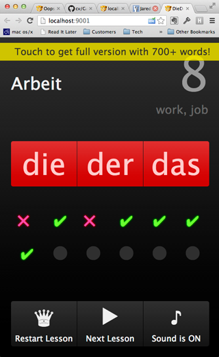

# Project Showcase

Here is a list of projects, either open source or I'm in the position to disclose source code.
It is meant as a quick glimpse over my project organisation and coding skills.

## Draagle Client

Draagle Client is a client application for an online drugs database Draagle. It is written in `javascript`
and using google closure toolchain for code optimisation. Latest production code is deployed at
the site [www.draagle.com](http://www.draagle.com)

Url of the repository: [git@bitbucket.org:akotnik/draagle-client.git](git@bitbucket.org:akotnik/draagle-client.git)

This is a private repository, so please, create an account at [bitbucket.org](http:/www.bitbucket.org)
and send me your email so I can grant you acccess.

## ROA (Register of Obstetrical Analgesias)

A Register of obstetrical analgesias in use in Slovenian nurseries.
Application provides guided data entry and basic statistics. This project
demonstrates the following skills:

  - javascript/coffeescript programing
  - automating development and deployment tasks with grunt
  - knowledge of Angular.js
  - application of REST service

Installation:

    git clone git@bitbucket.org:akotnik/draagle-roa.git
    cd draagle-roa
    npm install && bower install && grunt server

Url of the repository: [https://bitbucket.org/akotnik/draagle-roa](https://bitbucket.org/akotnik/draagle-roa)

## Die-der-das

Die-der-das a game helping to remember definite articles of german nouns. It is written in `javascript` and exposed as a native
iOS and android application using [Adobes's Phonegap](http://phonegap.com/).

Repository url: [https://bitbucket.org/akotnik/diederdas3](https://bitbucket.org/akotnik/diederdas3)

This is a private repository, so please, create account at [bitbucket.org](http:/www.bitbucket.org)
and send me your email so I can grant you access.

## Nonsense

Short component to help sites comply with European/Slovenina buerocratic nonsense about user privacy and cookies. Code
is selfcontained and written in pure `javascript` not making any assumptions of jQuery or any other library.

Project is bower compliant and release version is minified with google closure compiler. It demonstrates
dramatical reduction in size accomplished with google closure compiler when
code is properly annotated.

Repository url: [https://github.com/alesk/nonsense](https://github.com/alesk/nonsense)

## Android Videoplayer

This is a really tiny bit of code explaining the mechaism of launching external youtube application to play videos in
androdi's WebView. The projectd evolved from the need to improve user experience wehn browsing content rich site within
android native application.

Repository url: [github.com/alesk/videobrowser](https://github.com/alesk/videobrowser)

## Xmass Live Wallpaper

This is Live Android Wallpaper featuring Xmass Fireplace Sceene. It is written in Java and is composed from tiny animation
engine and skeleton for android's live wallpaper.

The artwork is proprietary, created by Andrej Dušič, so I can't licence it as open source. Please, create
account at bitbucket.org and let me know your email so I can grant you access.

Url of repositories: 

  - [https://bitbucket.org/akotnik/xmass-wallpaper](https://bitbucket.org/akotnik/xmass-wallpaper)
  - [https://bitbucket.org/akotnik/xmass-animation](https://bitbucket.org/akotnik/xmass-animation)
